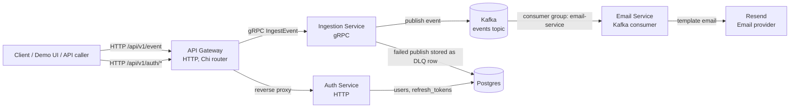
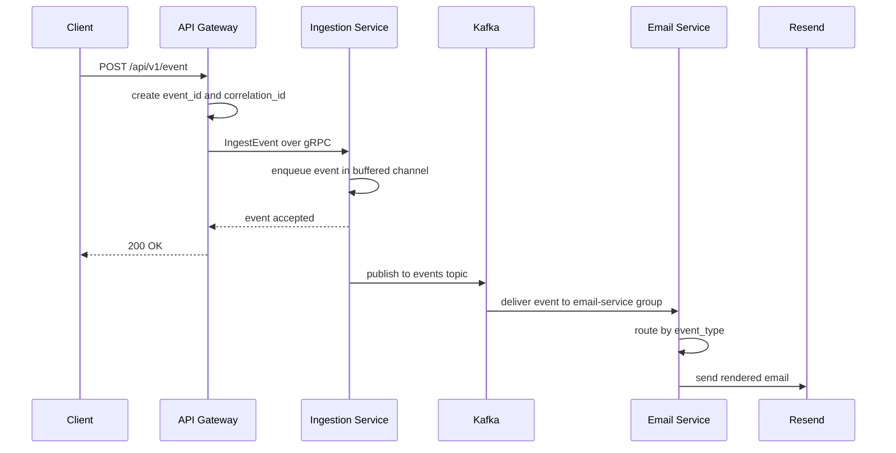
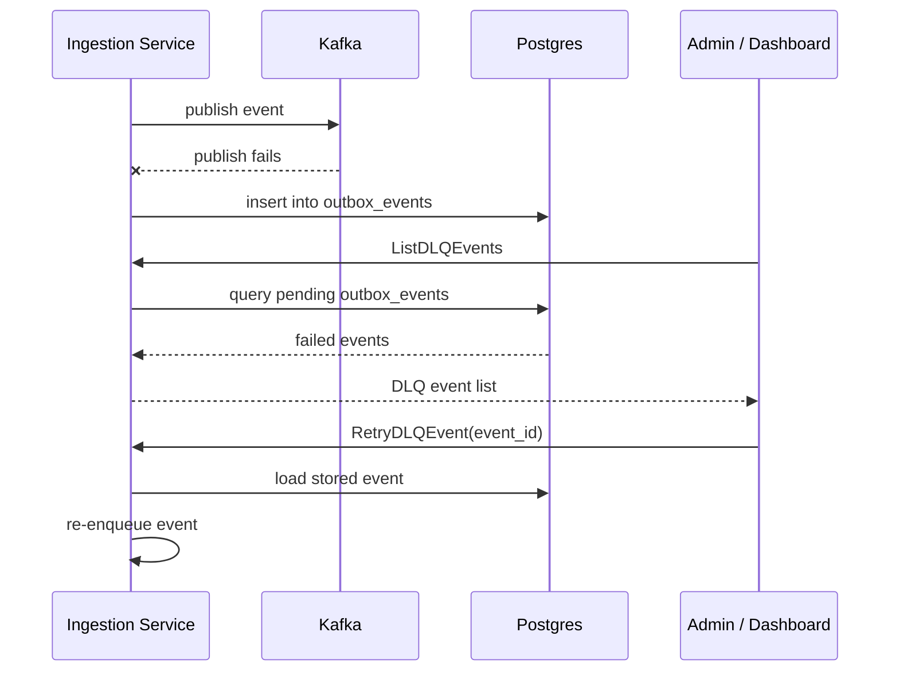

# Siphon

Siphon is an event ingestion and notification system written in Go. The project is built as a small distributed system: an API Gateway receives HTTP traffic, an Auth service owns user authentication, an Ingestion service accepts events over gRPC and publishes them to Kafka, and an Email service consumes events and sends templated emails through Resend.

The important thing to understand is that Siphon is not just "send an email from an API request". It is practicing the shape of a production event-driven system: receive an event, assign identifiers, move it through a broker, isolate consumers, store failed events, and expose a way to inspect and retry failures.

Some production pieces are already present. Some are intentionally still rough. This README documents both clearly.

## Current Architecture

At a high level, external clients talk to the API Gateway. The gateway forwards auth requests to the Auth service and event requests to the Ingestion service. The Ingestion service writes events to Kafka. The Email service consumes from Kafka and dispatches the right email handler based on `event_type`.



The same architecture in a rough, hand-drawn-style view:

```text
            browser / curl / demo script
                     |
                     v
              +-------------+
              | api-gateway |
              +-------------+
              /             \
             /               \
            v                 v
    +-------------+     +----------------+
    | auth-svc    |     | ingestion-svc  |
    | register    |     | grpc endpoint  |
    | login       |     | kafka producer |
    | refresh     |     +----------------+
    +-------------+              |
            |                    |
            v                    v
      +-----------+          +--------+
      | postgres  |          | kafka  |
      +-----------+          +--------+
            ^                    |
            |                    v
     failed events         +-----------+
     stored here           | email-svc |
                           +-----------+
                                 |
                                 v
                              Resend
```

## Services

### API Gateway

The API Gateway is the public HTTP entrypoint. It lives in `cmd/api-gateway` and wires routes from `internal/gateway/routes`.

Auth traffic is proxied to the Auth service:

```go
r.Handle("/auth/*", authProxy)
```

Event traffic is handled directly by the gateway handler and then sent to the Ingestion service over gRPC:

```go
r.Post("/event", handler.CreateEvent)
```

There are also admin-ish DLQ endpoints:

```go
r.Get("/dlq/events", handler.GetDLQEvents)
r.Post("/dlq/events/{id}/retry", handler.RetryDLQEvent)
```

### Auth Service

The Auth service is an HTTP service in `cmd/auth-svc`. It owns users, password hashing, login, JWT generation, and refresh tokens.

The main routes are:

```text
POST /api/v1/auth/register
POST /api/v1/auth/login
POST /api/v1/auth/refresh
```

Passwords are hashed with `bcrypt`, which is the right kind of primitive for password storage because it is intentionally slow and salted. The service uses JWT access tokens for short-lived authentication and refresh tokens for longer-lived session renewal.

The database tables are:

```text
users
refresh_tokens
```

### Ingestion Service

The Ingestion service is a gRPC service in `cmd/ingestion-svc`. The public contract lives in `proto/ingestion/v1/ingestion.proto`.

The central RPC is:

```proto
rpc IngestEvent(IngestEventRequest)
    returns (IngestEventResponse);
```

An event carries:

```text
event_id
event_type
source
version
timestamp
correlation_id
metadata
payload
```

The service accepts an event and puts it into an in-memory buffered channel:

```go
eventQueue chan *ingestionv1.IngestEventRequest
```

Then a pool of worker goroutines reads from the channel and publishes messages to Kafka:

```go
for i := 0; i < 10; i++ {
    go s.kafkaWorker()
}
```

This is a producer-worker pattern. The gRPC request path stays fast because it only has to enqueue the event. The slower Kafka publish happens in background workers.

### Kafka

Kafka is the event broker. The Ingestion service publishes to a single topic:

```text
events
```

The Email service consumes from the same topic using this consumer group:

```text
email-service
```

Kafka gives you durable event streaming and consumer-group coordination. A consumer group means multiple instances of the same service can share work. If three email-service instances are running in the same group, Kafka will divide partitions among them so each message is processed by one instance in that group.

Different services should use different consumer groups. For example, an analytics service and an audit service could both read the same `events` topic without stealing messages from the email service:

```text
events topic
  -> email-service consumer group
  -> analytics-service consumer group
  -> audit-service consumer group
```

At the moment, Siphon has one real consumer: the Email service.

### Email Service

The Email service lives in `cmd/email-svc`. It creates a Kafka reader, listens to the `events` topic, and sends each event to the email router.

The consumer is in `internal/email/kafkaconsumer.go`:

```go
msg, err := c.reader.ReadMessage(ctx)
```

The router uses a handler registry instead of a giant switch statement. That means each event type maps to a handler:

```go
handlers := map[string]Handler{
    "signup_thankyou":  NewTemplateHandler[SignupThankYouData](...),
    "payment_success":  NewTemplateHandler[PaymentSuccessData](...),
    "payment_refunded": NewTemplateHandler[PaymentRefundedData](...),
}
```

This is the registry pattern. The router does not need to know the details of each email. It only needs to know which handler is registered for the incoming `event_type`.

Adding a new email now looks like this:

```text
create template -> create payload struct -> register handler
```

The template manager parses HTML templates from `internal/email/templates`. The service renders the selected template with typed payload data, then sends the HTML through Resend.

## Event Flow

The intended happy path looks like this:



The failure path currently focuses on Kafka publish failures:



This is why Postgres is involved in the DLQ flow. Kafka is excellent at streaming, but it is not a comfortable database for dashboard-style queries like "show me all failed events sorted by time". Persisting failed events in Postgres makes them easy to list, filter, inspect, and retry.

## Database Design

The schema is managed with Goose migrations and queried through sqlc-generated Go code.

The Auth service uses:

```text
users
refresh_tokens
```

The Ingestion service uses:

```text
outbox_events
```

The `outbox_events` table currently stores failed events:

```sql
CREATE TABLE outbox_events (
  event_id UUID PRIMARY KEY,
  event_type TEXT NOT NULL,
  source TEXT NOT NULL,
  version TEXT NOT NULL,
  timestamp TIMESTAMPTZ NOT NULL,
  correlation_id UUID NOT NULL,
  metadata JSONB NOT NULL,
  payload JSONB NOT NULL,
  status TEXT NOT NULL DEFAULT 'pending',
  created_at TIMESTAMPTZ NOT NULL DEFAULT NOW(),
  processed_at TIMESTAMPTZ,
  error_message TEXT
);
```

## Patterns Used

The project uses a service-per-boundary style. Auth, ingestion, email, and gateway concerns live in separate packages and binaries under `cmd`. This keeps the runtime responsibilities clear: Auth handles identity, Ingestion handles event acceptance, Email handles side effects, and the Gateway handles external HTTP entry.

The Gateway uses a reverse proxy for Auth. Instead of re-implementing auth endpoints in the gateway, it forwards `/auth/*` traffic to the Auth service. That keeps the gateway thin.

The Ingestion service uses gRPC for internal service communication. gRPC gives a typed contract through protobuf, which is useful when services are owned separately or when you want generated clients and servers.

The Ingestion service also uses a producer-worker pattern. The request handler enqueues work, while background workers publish to Kafka. This improves request latency, but the current in-memory buffer does not survive process crashes.

The Email service uses the registry pattern. Instead of one large `switch event.EventType`, it has a map of event types to handlers. This makes email features easier to add without making the router more complex over time.

The database layer uses sqlc. SQL remains explicit in `sqlc/*/query.sql`, and sqlc generates typed Go methods. That gives more control than a heavy ORM while avoiding manual row scanning everywhere.

The project uses a basic DLQ pattern. Failed Kafka publishes are stored in Postgres so they can be listed and retried. The retry path loads the stored event and sends it back through ingestion.

## Technical Terms In Plain English

An event is a record that says something happened. For example, `payment_success` means a payment succeeded. The event should contain enough data for consumers to react without needing to call back into the original service for everything.

An event type is the string that tells the system what kind of event it is. In this project, examples include `signup_thankyou`, `order_success`, and `payment_failed`.

An event ID is the unique identifier for one event. It is useful for tracing, deduplication, retries, and debugging.

A correlation ID connects multiple operations that belong to one larger request or workflow. If one user action causes three events across three services, those events can share a correlation ID so logs and dashboards can show the whole story.

Kafka is the message broker. Producers write messages to topics. Consumers read messages from topics. It decouples services so the Ingestion service does not need to know exactly which services will react to an event.

A topic is a named stream in Kafka. This project currently uses one topic called `events`.

A consumer group is how Kafka distributes work across instances of the same consumer. Every service that needs its own copy of events should use its own consumer group.

A DLQ, or dead letter queue, is where failed messages go when they cannot be processed normally. In this project, failed Kafka publishes are stored in Postgres so they can be inspected and retried.

An outbox is a table that stores events before they are published to a broker. The full outbox pattern prevents losing events when a service crashes. Siphon has an `outbox_events` table, but it currently works more like a DLQ table because only failed publishes are inserted.

Idempotency means the same request can be safely repeated without creating duplicate side effects. This is not enforced end to end yet.

Retries mean trying a failed operation again. Retry endpoints exist for DLQ events, but automatic retry policies are not implemented yet.

Event tracking means being able to see where an event is in its lifecycle. Siphon has partial tracking for failed events, but successful events are not stored or queryable yet.

Rate limiting means controlling how many requests a client can make in a time window. This is not implemented yet.

JWT means JSON Web Token. The Auth service issues JWT access tokens, but the API Gateway does not yet enforce JWT authentication for protected routes.

Refresh token rotation means replacing old refresh tokens with new ones over time, usually invalidating the old token. Refresh tokens exist, but stricter rotation and reuse detection should be improved.

## Running The Project

The project uses environment variables loaded from `.env`. The exact values depend on your local setup, but the services expect values like:

```text
DATABASE_URL
JWT_SECRET
AUTH_SVC_URL
INGESTION_SVC_URL
KAFKA_BROKER
KAFKA_URL
RESEND_API_KEY
FROM_EMAIL
PORT
```

Common Taskfile commands:

```sh
task db:migrate
task run:auth
task run:gateway
task protoc
```

To regenerate protobuf stubs:

```sh
task protoc
```

To run compile checks:

```sh
go test ./...
```

## Roadmap

### Completed

- [x] Separate API Gateway service
- [x] Separate Auth service
- [x] Separate Ingestion service
- [x] Separate Email service
- [x] Auth registration endpoint
- [x] Auth login endpoint
- [x] JWT access token generation in Auth service
- [x] Refresh token storage in Auth service
- [x] Password hashing with bcrypt
- [x] Postgres migrations with Goose
- [x] Typed SQL access with sqlc
- [x] gRPC contract for event ingestion
- [x] Generated protobuf Go code
- [x] Gateway-to-ingestion gRPC client
- [x] Kafka producer in Ingestion service
- [x] Buffered ingestion queue with worker goroutines
- [x] Kafka consumer in Email service
- [x] Email template rendering
- [x] Resend email provider client
- [x] Registry-based email handler routing
- [x] DLQ events persisted in Postgres for dashboard-style querying
- [x] List DLQ events endpoint
- [x] Retry DLQ event endpoint
- [x] Event identifiers and correlation identifiers in the ingestion contract

### Highest Priority

- [ ] Protect admin/DLQ endpoints with JWT auth in the API Gateway
- [ ] Add role or admin authorization for DLQ routes
- [ ] Fix Kafka message format mismatch between Ingestion producer and Email consumer
- [ ] Decide the real email event schema, including how the recipient email reaches the Email service
- [ ] Store the actual failure reason in `outbox_events.error_message`
- [ ] Wire `MarkOutboxEventProcessed` and `MarkOutboxEventFailed` into the DLQ retry flow
- [ ] Demonstrate a failed event going into `outbox_events` and being retried successfully

### Event Reliability

- [ ] Enforce idempotency with stable client-provided idempotency keys or event IDs
- [ ] Store accepted events before publishing to Kafka
- [ ] Convert `outbox_events` into a real transactional outbox, or rename/split it into a true DLQ table
- [ ] Add automatic retry policy for transient Kafka publish failures
- [ ] Add retry count and last retry timestamp to failed events
- [ ] Make Email service idempotent by storing processed event IDs
- [ ] Prevent duplicate emails on Kafka redelivery
- [ ] Add bulk email sending behavior where appropriate

### Event Tracking And Audit

- [ ] Store successful events
- [ ] Add `GET /events/{event_id}`
- [ ] Add event timeline/history table
- [ ] Track lifecycle states like `accepted`, `published_to_kafka`, `consumed_by_email_service`, `email_sent`, and `email_failed`
- [ ] Add audit log inspired by the Kronos project
- [ ] Add correlation-ID based event lookup
- [ ] Add dashboard-friendly filters for event type, status, source, and time range

### Observability And Operations

- [ ] Add a proper structured logging framework
- [ ] Use structured logs consistently across all services
- [ ] Include `event_id` and `correlation_id` in logs
- [ ] Add request logging middleware in HTTP services
- [ ] Add gRPC logging/interceptors in Ingestion service
- [ ] Add metrics for accepted events, published events, failed events, retries, and sent emails
- [ ] Add rate limiting at the API Gateway
