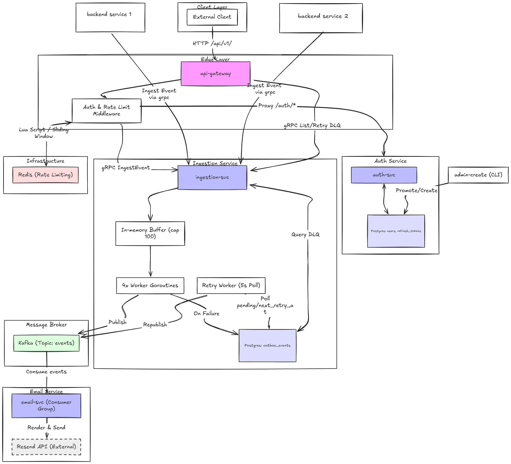

# Siphon

Siphon is an event ingestion platform built as a set of small Go microservices. Clients authenticate, submit events over HTTP, and those events get durably queued, published to Kafka, and fanned out to consumers (like an email sender), with a proper retry/dead-letter path when a downstream publish fails.

This mirrors how event-driven pipelines work at companies sending mail at serious scale. Think of how Amazon fires off an "order confirmed" event the moment you check out. That event doesn't send the email itself, it gets dropped onto a queue, and a separate consumer picks it up, renders the template, and sends it through the delivery provider. If that consumer is down or the provider rate-limits you, the event isn't lost: it waits and gets retried. Siphon is a small-scale version of exactly that pattern. `ingestion-svc` is the "something happened" front door, Kafka is the queue, and `email-svc` is the consumer that turns events into actual emails.

It's a playground for doing the unglamorous parts of a backend properly: auth, rate limiting, retries, idempotency, and reliable messaging.

## Architecture



- **api-gateway** is the single entry point clients talk to over HTTP. It authenticates requests, applies rate limiting, and proxies traffic to `auth-svc` and `ingestion-svc` over gRPC.
- **auth-svc** owns users, password hashing, and JWT/refresh-token issuance.
- **ingestion-svc** accepts events over gRPC, buffers them in memory, and hands them off to a small worker pool that publishes to Kafka. Anything that fails to publish lands in a Postgres-backed outbox instead of being dropped.
- A **retry worker** inside ingestion-svc polls the outbox on an interval and retries failed events with exponential backoff, until it succeeds or hits the retry cap.
- **email-svc** consumes events off Kafka and sends email via Resend.
- **Redis** backs the rate limiter, **Postgres** backs users/refresh tokens/the outbox, and **Kafka** is the event backbone.

## Tech stack

- **Go**: every service
- **chi**: HTTP routing on the gateway
- **gRPC + Protocol Buffers**: internal service-to-service calls (gateway to auth-svc, gateway to ingestion-svc)
- **Kafka** (`segmentio/kafka-go`): event backbone between ingestion-svc and email-svc
- **PostgreSQL** + **pgx** + **sqlc**: typesafe, hand-written-SQL-free data access
- **goose**: SQL migrations
- **Redis** (`go-redis`): sliding-window rate limiting
- **golang-jwt**: access/refresh token auth
- **bcrypt**: password hashing
- **Resend**: transactional email delivery
- **Docker Compose**: local multi-service orchestration
- **Helm** (`helm/`): Kubernetes deployment

## Backend concepts this project implements

- **Sliding-window rate limiting**: a Redis Lua script atomically tracks requests in a sorted set per user, giving a true sliding window rather than a fixed bucket, with fail-open behavior if Redis is unreachable.
- **JWT auth with role-based access control**: short-lived access tokens (HS256, validated issuer/audience/expiry) plus long-lived rotating refresh tokens, with role-gated middleware for admin-only routes.
- **Refresh token rotation**: every refresh deletes the old token and issues a new one, so a stolen refresh token can't be replayed indefinitely.
- **Transactional outbox / dead-letter queue**: a failed Kafka publish is persisted to Postgres instead of being lost, decoupling ingestion durability from broker availability.
- **Exponential backoff with jitter**: the DLQ retry worker backs off `base * 2^attempt` (capped) with randomized jitter, so retries don't thunder against a recovering dependency.
- **Idempotency keys**: clients can pass an `Idempotency-Key` header that becomes the event's primary key in the outbox table, so duplicate submissions collide safely instead of double-processing.
- **Bounded in-memory buffering with backpressure**: ingestion-svc uses a fixed-capacity buffered channel and a small worker pool; when the buffer is full, it returns a clear "resource exhausted" error instead of queuing unboundedly or blocking forever.
- **Internal gRPC / external REST split**: a clean boundary between the public-facing HTTP API and the typed, efficient gRPC contracts services use to talk to each other.
- **Typesafe database access via sqlc**: queries are written as plain SQL and compiled into typed Go, keeping the query and the code that runs it in sync.

## Why these choices

Kafka plus an outbox/DLQ gives event ingestion a real durability guarantee: a broker hiccup becomes a retry, not a lost event. gRPC internally keeps service-to-service calls fast and strongly typed, while REST at the edge keeps the public API easy for any client to consume. Redis was a natural fit for rate limiting since it's already the right tool for fast, shared, expiring counters, and a Lua script keeps the check-and-increment atomic without extra round trips. sqlc was chosen over an ORM to get compile-time safety on queries without giving up control over the actual SQL.

## Running locally

The whole stack (Postgres, Redis, Kafka, migrations, and all four services) runs with Docker Compose.

1. Copy the example env file and fill in the secrets you care about:
   ```bash
   cp .env.example .env
   ```
2. Start everything:
   ```bash
   docker compose up --build
   ```

That brings up:
- `api-gateway` on `:5000`
- `auth-svc` on `:5002`
- `ingestion-svc` on `:5003`
- Postgres on `:5432`, Redis on `:6379`, Kafka on `:9094` (host-accessible)

Migrations and Kafka topic creation run automatically as part of `docker compose up`.

### Running a single service natively

If you'd rather iterate on one service with `go run` instead of rebuilding a container each time, each `cmd/<service>` has its own `.env`. Fill it in, then use the matching [Task](https://taskfile.dev) target:

```bash
task run:auth      # auth-svc
task run:gateway   # api-gateway
task run:ingestion # ingestion-svc
task run:email     # email-svc
task dev           # all four at once
```

You'll still need Postgres, Redis, and Kafka reachable (e.g. via `docker compose up postgres redis kafka`). Migrations can be run manually with:

```bash
task db:migrate
```

### Deploying to Kubernetes

A Helm chart is available under [`helm/siphon`](helm/siphon) for deploying the full stack to a Kubernetes cluster.
